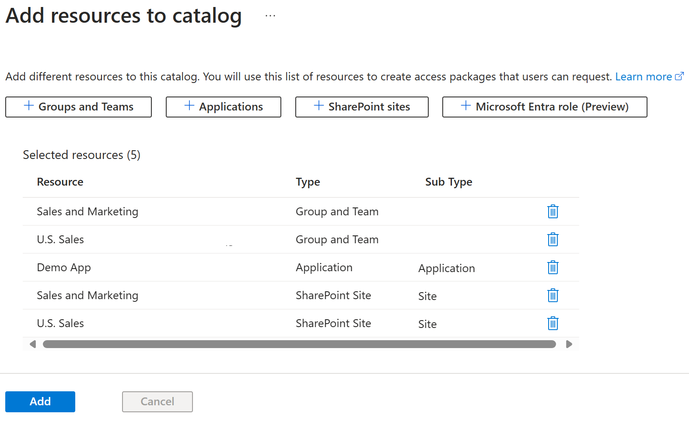

---
lab:
    title: 'Lab 1: Building a catalog for use in Entitlement'
    module: 'Module : Deploying access using Microsoft Entra entitlement management'
---

# Lab 1: Building a catalog in Microsoft Entra entitlement management

## Lab scenario

In a mid-sized software development company, the IT department decides to implement Microsoft Entra for entitlement management. The primary goal is to streamline access to resources and applications across the organization. With Microsoft Entra, they can define access packages based on roles or projects, which simplifies the process of granting or revoking access rights. For instance, when a new developer joins a project, the IT department can easily provide them with the necessary access by assigning them to the corresponding access package. This not only saves time but also reduces the risk of unauthorized access. Furthermore, Microsoft Entra's periodic access reviews ensure that only the right people have access to sensitive resources. In the implementation lab, the IT team will set up various access packages, define policies for automatic access assignment and revocation, and conduct a mock access review.

## Objectives

After you complete this lab, you will be able to:

- Build a catalog.
- Configure an access package.
- Deploy an access package to a user.
- Accept the entitlement as a user and confirm resource access.
- Revoke access to a package.

## Lab Setup
  - **Estimated Time**: 30 minutes

### Exercise 1: Create a catalog for the Sales team

#### Task 1: Create a Catalog

1. Launch the Microsoft Entra admin center at `https://Entra.Microsoft.com`.

1. In the menu on the left, navigate to **Identity governance** then **Entitlement management**.

1. Select **Catalogs** from the menu.

 

1. Select **+ New catalog** at the top of the screen.

1. Name and describe your **New catalog** with the following values:

  | Field | Value |
  | :---  | :---  |
  | Name  | `catSales` |
  | Description | `Use this catalog to assign resources for memebers of the Sales team.` |
  | Enabled | Yes |
  | Enabled for external users | No |
  | | |

1. Select **Create**.

#### Task 2: Add resources to the catalog

1. If you are not already there, navigate to the **Microsoft Entra admin center**, **Identity governance**, **Entitlement management**, then **Catalogs** page.

1. Select the **catSales** that we created in the previous task.

1. Select **Resources** from the menu.

1. Next select **+ Add resources** from the top of the page.

 

1. Using the selectors at the top of the screen, add the following resources:

  | Resource Type | Value |
  | :---  | :---  |
  | + Groups and Teams  | Sales and Marketing, and U.S. Sales |
  | + Applications | LinkedIn |
  | + SharePoint sites | Sales and Marketings, and U.S. Sales |
  | | |

1. Select the **Add** button.

#### Task 3: Create a new user to receive the entitlement

1. If you are not already there, navigate to the **Microsoft Entra admin center**.

1. From the menu on the left, select **Identity**, **User**, then **All User** from the menus.

1. Select **+ New user** at the top of the page.

1. Fill in the values on the **Basics** page:

  | Field | Value |
  | :---  | :---  |
  | User principal name  | `ChrisGr` |
  | Diplay name | `Christopher Green` |
  | Auto-generated password | Checked on |
  | Account enabled | Checked on |
  | | |

1. Copy and paste the "Password" to a safe location like Notepad (you will need the password later in this lab).

1. Select the "Properties" tab.

1. At the bottom of the Properties screen set the **Usage location = United States**.

1. Select **Review + Create** then select **Create**.

#### Task 4: Generate the Access package

1. In Microsoft Entra admin center, select **Identity governance** then select **Entitlement management**.

1. From the Entitlement management menu, select **Access packages**.

1. Select **+ New access package** at the top of the screen.

1. Enter the requested values:

  | Field | Value |
  | :---  | :---  |
  | Name  | `pckSales` |
  | Diplay name | `Use this access package to assign resources to members of the Sales team.` |
  | Catalog | catSales |
  | | |

  **Note** - You must pick the catSales catalog we created in the previous task. This will provide the list of resources available to be assigned in this package.  There is a General package that is listed as the default.  If you accidentally chose this, you will not see any resources available.

1. Select the "Resource roles" tab.

1. Select the resources that you want to provide in his Access package, from the items in the catSales catalog. Then use the **Select role** dropdown to set the Role to listed in the table below.

  | Resource Type | Value | Role |
  | :---  | :---  | :--- |
  | + Groups and Teams  | Sales and Marketing | Member |
  | + Applications | LinkedIn | msiam_access |
  | + SharePoint sites | U.S. Sales | U.S. Sales Members |
  | | |

1. Set the **Select role** dropdown to set the Role to **Member** for each item.

1. Use the **Next: Requests>** to move to the Requests tab.

1. For the **Users who can request access** select the option **None (administrator direct assignment only).

1. Set the **Enable** to **Yes**.

1. Move to the **Lifecycle** tab using the labels at the top of the screen.

1. Choose the values to set the lifecycle of the pacakge:

  | Field | Value |
  | :---  | :---  |
  | Access package assignments expire  | Number of Days |
  | Assignments expire after | 30 |
  | Users can request specific timeline | No |
  | Require access reviews | No |
  | | |

1. Select the **Review + create** at the bottom of the screen.

1. Review the values you chose on the Review + create screen.

1. Select **Create** to build your Access package.

#### Task 5: Assign the package to Christopher

1. Make sure you are in **Microsoft Entra admin center**, **Identity governance**, **Entitlement management**, and have the **Access packages** menu open.

1. Select the **pckSales** that we create in the previous task.

1. From the menu select **Assignments**.

1. Select **+ New Assignment** from the top of the screen.

1. For the **Select policy** use the **Initial Policy** provided in the dropdown.

1. Make sure the **User already in my directory** is marked.

1. Select the **Add users** item from the dialog.

1. Find **Christopher Green** in the list of users.  Put a check in the box next to that name.  Then select the **Select** button at the bottom of the screen.

1. Leave the rest of the values set at the defaults.

1. Select the **Add** button at the bottom of the page.

#### Task 6: Check to see if Christopher Green has been added

1. Open a **New InPrivate window** on your browser.

1. Connect to **Microsoft Entra admin center** at `https://entra.microsoft.com` address.

1. Log into the site using your Chistopher Green account and password created earlier.

1. You will be prompted to change your password.  Set a new password and record it in a tool like Notepad for future use.

1. Select **Identity**, then **Users**, then **All Users**, and then select **Christopher Green**.

1. From the menu on the left, select **Groups**.

1. Confirm that you have been granted access to the **Sales and Marketing** group, per the Access Package.

1. From the menu on the left, select **Applications**.

1. Confirm that you have **LinkedIn** is your assigned applications.

#### Task 7: Challenge - Dynamic changes to the Access package

  **Note** - This task does not have step by step instructions. You are provide the set of tasks, and you can reference previous steps above to remind you of where to make specific changes.

- Make sure you logged into **Microsoft Entra admin center** as your admin account.
- Open your **pckSales** Access package.
- Go to the **Resources roles** and choose to remove the **Sales and Marketing** group and add in the **U.S. Sales** group instead.
- Use the **Assignments** tab to **Reprocess** the assignment.
- Log out and log back in as Christopher Green.  Note that the group assignments have changed.  That quick and easy.
- Revoke access by deleting the Assignment for Christopher Green.

### Conclusion
This is a simple lab to demo the basic features of Entitlement management.  Think of the option you could use this feature for; and the advanced configuration options you could configure within the lab.
