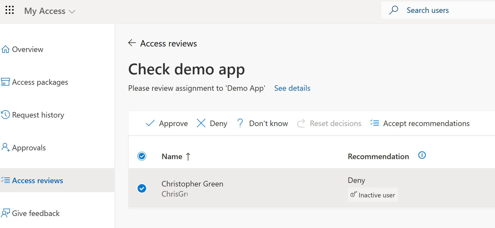

---
lab:
    title: 'Lab 2: - Create and manage an Access review'
    module: 'Module : Deploying access using Microsoft Entra entitlement management'
---

# Lab 2: Create and manage an Access review

## Lab scenario

Access reviews help ensure that only the right people have access to secure resources and information. An access review can be set up for one-time or recurring periods, and it enables reviewers to approve or deny access based on factors like user role, last sign-in, or risk level. The results of these reviews can then be used to update user access rights, ensuring that they align with company policies and compliance requirements. For this company, they use an access review when an employee changes roles within a company. For example, if an employee moves from a sales role to a marketing role, they may no longer need access to certain sales databases or applications. An access review would help identify these unnecessary permissions and allow the company to revoke them, thereby reducing the risk of unauthorized access or data leaks.

#### Estimated time: 15 minutes

### Exercise 1 - Confirm that we don't have users accessing the Demo App that should not be using that resource.

#### Task 1 - Create an Access Review - Review Type

1. Sign in to [https://entra.microsoft.com](https://entra.microsoft.com) using a Global Administrator account.

    **Important** - To use and configure Microsoft Entra ID terms of use, you must have:
    - Microsoft Entra ID Premium P1, P2, EMS E3, or EMS E5 subscription.
    - If you don't have one of these subscriptions, you can get Microsoft Entra ID Premium trial.
    - One of the following administrator accounts for the directory you want to configure:
        - Global Administrator
        - Security Administrator
        - Conditional Access Administrator

1. Open the **Identity** menu, and then select **Identity Governance**.

1. In the left menu select **Access reviews**.

1. On the top menu, select **+ New access review**.

1. In the New access review pane, select the **Applications** item in the 'Select what to review' dropdown.

1. Use the **+ Select applications(s)** to choose the **Demo App** from the list.

1. For the **Scope** select **All users**.

1. Select the **Next: Reviews** button at the bottom of the screen.

#### Task 2 - Create an Access Review - Reviews

1. Temporarily mark the **Multi-stage review** box with a check.

 **Note** - This is where you can choose to have several layers to your Access review.  Use this for very important resouces, so that a single person's review does not add or remove a critical resource from user access.  We are not going to build / test a multi-stage; but the process is very similar.

1. Uncheck the **Multi-stage review** box.

1. Fill out the Review page with the below values:

| Field name | Value |
| :--- | :--- |
| Select reviewers | Selected users(s) or groups(s) -- Adele Vance |
| Duration (in days) | 5 |
| Review recurrence | Monthly |
| Start date | Today's date |
| End | End after number of occurences |
| Occurences | 3 |
| | |

#### Task 3 - Create an Access review - Settings

1. Leave **Auto apply results to resoureces** box in the unchecked state.

 **Note** - we want to make we validate the results after the review is complete.

1. Chose the option **Remove access** for the **If reviewer don't respond**.

 **Note** - this is a setting you can use to control your level of security.  If no review responds in a less secure security posture, you can got with Approve Access.  In a very secure security posture, you can use the Remove Access.  When implementing your own solutions, pick what works best for your company.

1. For **At end of review, send notification to** select the admin account you are using for this lab.

1. Leave the **Enable review decision helpers** at their default values.

1. Set the **Additional content for reviewer email** enter the value `Please complete your Access Review as soon as you can.`

1. Select the **Next: Review + Create**.

1. Enter the below values for the name and description:

| Field name | Value |
| :--- | :--- |
| Review name | `Check Demo App` |
| Description | `In this access review, we check to see if the right people have access to Demo App.` |
| | | 

#### Task 4 - Log in as Adele to run the Access Review

1. Close your browser, if you have it open.

1. Open the browser and connect to `https://outlook.office.com/`.

1. Log in as Adele Vance based on your tenant.

 **Note** - You should have an email from **Microsoft Security** with a subject of **Action required: Review access to the Demo App...**

1. Select the **Start review >** button.

 

1. Put a check-mark in the circle next to **Christopher Green**.

1. Select the **Deny** option from the top menu.

1. Enter a reason to deny access to the resource. Example: `The sales campaign is over and Christopher does not need access any more`.

1. Select the **Submit** button to send your recommendation.

#### Task 5 - Confirm the Access review results

1. Close your browser, if you have it open.

1. Open the browser and connect to `https://Entra.Microsoft.com/`.

1. In the menu on the left open **Identity governance**.

1. Select **Access reviews**.

1. Select the **Check demo app** review that we built earlier in this lab.

1. Review the response from AdeleV.
